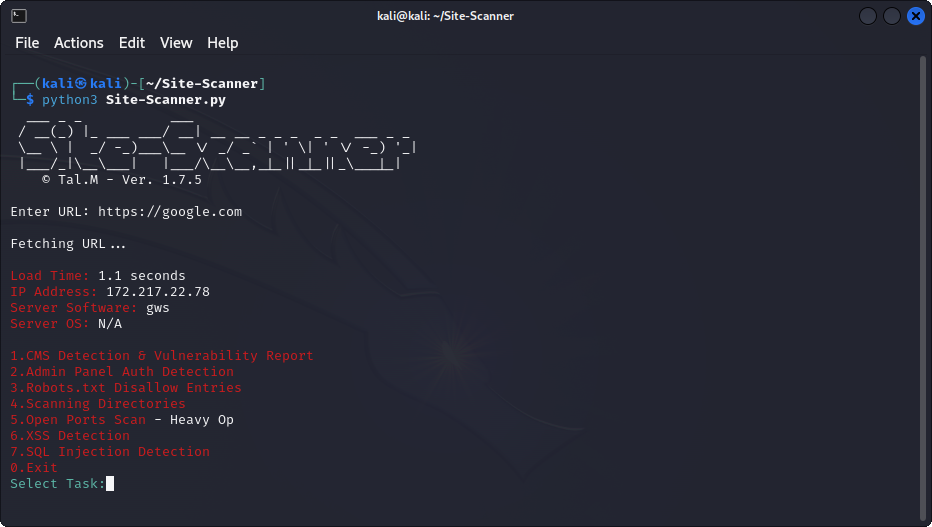

<h1 align="center">Site-Scanner</h1>

Web application vulnerability assessment tool.

## :dart: Features

- **Basic Info:** Quick site information (Load Time, IP Address, Server OS...).
- **Robots.txt Disallow Entries:** Detection of Robots.txt and printing Disallow Entries.
- **CMS Detection:** Automatically identifies the CMS used by a website (WordPress, Joomla, Drupal, etc.).
- **Vulnerability Report:** According to the indentified CMS will generate vulnerability report.
- **Login Page Search:** Searches for common login page variations based on the detected CMS.
- **Directory Scanning:** Searches for valid directories under the specified URL.
- **SQL Injection Check:** Tests for SQL injection vulnerabilities in query parameters.
- **XSS Detection:** Tests for SQL injection vulnerabilities in query parameters.
- **User-Friendly Interface:** Interactive and detailed shell menu.
- **Multi-Threaded:** Efficiently performs tasks in the background using threading.

## :zap: Getting Started

### Prerequisites

- Python 3.x.x
- Required Python packages: `requests`, `beautifulsoup4`

### Installation

1. Clone the repository: `git clone https://github.com/TalMaIka/Site-Scanner.git`
2. Navigate to the project directory: `cd Site-Scanner`
3. Requirements Installation: `pip install -r requirements.txt`

## :rocket: Usage

1. Run the tool: `python3 Site-Scanner.py` / Proxychains `proxychains python3 Site-Scanner.py`
2. Enter the URL of the website you want to analyze.
3. Choose your tasks according to the menu.

## :copyright: Contributing

Found a bug or want to contribute? Great! Please submit an issue or pull request.
