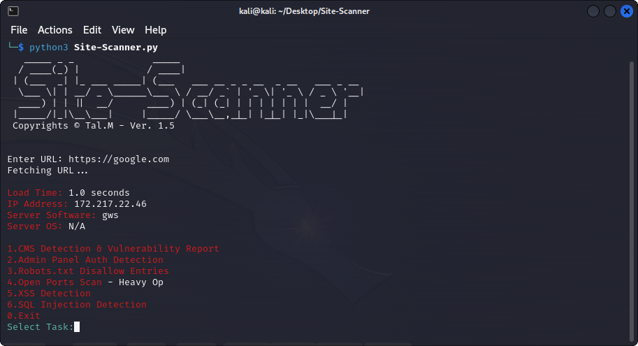

# Site Scanner

Site-Scanner makes it easy to perform security checks to ensure websites safety. 

- **Ver 1.5:** Few CMS variations added, Robots.txt disallow entries printing and Vulnerability report.

## Features

- **Basic Info:** Quick site information (Load Time, IP Address, Server OS...).
- **Robots.txt Disallow Entries:** Detection of Robots.txt and printing Disallow Entries.
- **CMS Detection:** Automatically identifies the CMS used by a website (WordPress, Joomla, Drupal, etc.).
- **Vulnerability Report:** According to the indentified CMS will generate vulnerability report.
- **Login Page Search:** Searches for common login page variations based on the detected CMS.
- **SQL Injection Check:** Tests for SQL injection vulnerabilities in query parameters.
- **XSS Detection:** Tests for SQL injection vulnerabilities in query parameters.
- **User-Friendly Interface:** Interactive and detailed shell menu.
- **Multi-Threaded:** Efficiently performs tasks in the background using threading.

## Getting Started

### Prerequisites

- Python 3.x
- Required Python packages: `requests`, `beautifulsoup4`

### Installation

1. Clone the repository: `git clone https://github.com/TalMaIka/Site-Scanner.git`
2. Navigate to the project directory: `cd Site-Scanner`
3. Requirements Installation: `pip install -r requirements.txt`

## Usage

1. Run the tool: `python3 Site-Scanner.py` / Proxychains `proxychains python3 Site-Scanner.py`
2. Enter the URL of the website you want to analyze.
3. Choose your tasks according to the menu.

## Contributing

Found a bug or want to contribute? Great! Please submit an issue or pull request.
